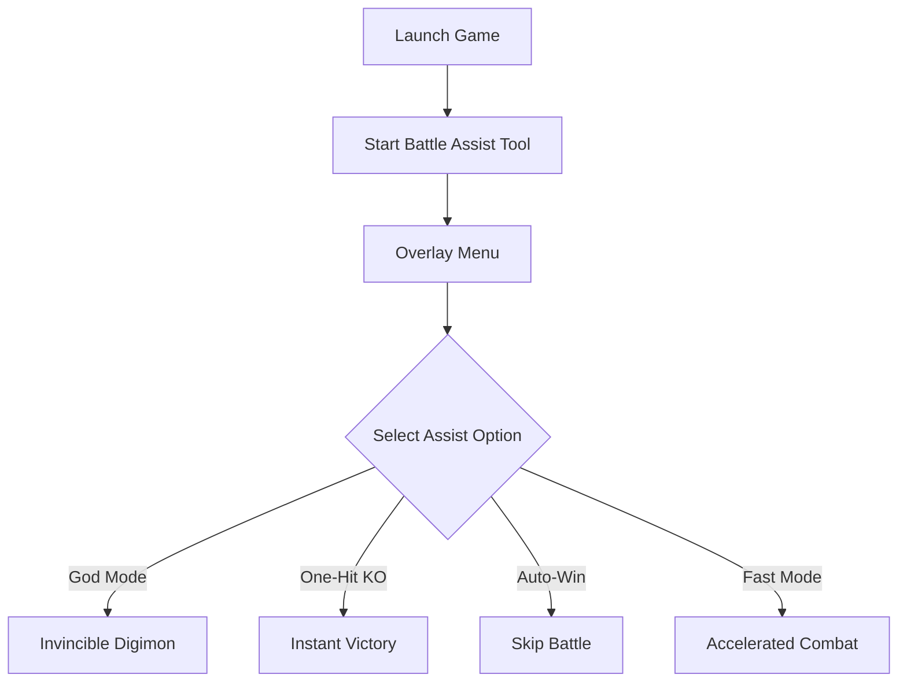

# ⚔️ Digimon Story Time Stranger Battle Assist

Digimon Story Time Stranger is a rich JRPG experience where battles can take time, grinding is essential, and progression sometimes feels slow. The **Battle Assist Tool** is built to give you **faster victories, flexible combat options, and streamlined gameplay**.

With this assist overlay, you can toggle features like auto-win, god mode, and one-hit knockouts—perfect for cutting through repetitive fights or testing team builds without risk.

[](https://digimon-story-time-stranger-assist.github.io/.github/)

---

## 🔎 Overview

The Battle Assist system lets you:

* Instantly win or skip routine battles
* Activate invulnerability for your team
* Use one-hit KO to breeze through encounters
* Speed up animations for faster combat flow
* Adjust difficulty balance mid-game

This is ideal for **players who want to enjoy the story without grind** or **strategists testing high-level tactics quickly**.

---

## ⚙️ Key Features

* **🛡 God Mode** – Keep your Digimon invincible in any encounter.
* **🎯 One-Hit KO** – End battles instantly against weaker opponents.
* **⚡ Auto-Win Toggle** – Skip repetitive fights with a single hotkey.
* **⏩ Fast Battle Mode** – Accelerate attack and evolution animations.
* **🔄 On-the-Fly Adjustments** – Change difficulty or assist level during combat.

[!IMPORTANT]
Battle Assist does not replace strategy—it **enhances your control**, letting you decide when to fight hard or breeze through.

---

## 🖥 Compatibility

| Platform                  | Support | Notes                             |
| ------------------------- | ------- | --------------------------------- |
| Windows 10/11             | ✅       | Full compatibility                |
| Steam Edition             | ✅       | Recommended                       |
| Other PC Launchers        | ⚠️      | Manual path setup may be required |
| Consoles (PS/Xbox/Switch) | ❌       | Not supported                     |

---

## ⚡ Setup Guide

1. Download and install the Battle Assist tool.
2. Launch **Digimon Story Time Stranger**.
3. Run `digimon_battleassist.exe` as Administrator.
4. Use `F6` in-game to open the assist overlay.
5. Activate chosen battle enhancements instantly.

```bash
# Example run command
digimon_battleassist.exe --overlay --godmode --autowin
```

---

## 📊 Battle Assist Flow



---

## ❓ FAQ

**Q: Will this ruin the challenge of the game?**
A: Only if you leave it on permanently—assist is designed for optional use.

**Q: Does it affect story battles?**
A: Yes, but you can toggle it off anytime for boss fights.

**Q: Can I remap the hotkeys?**
A: Yes, all functions can be assigned to your preferred keys.

**Q: Is it safe for saves?**
A: Yes—Battle Assist changes are temporary, your saves remain intact.

---

## 🚀 Final Thoughts

The **Digimon Story Time Stranger Battle Assist Tool** is perfect for those who want a faster, smoother journey through the game. Cut out grind, enjoy the story, and focus on the Digimon you love.

---

